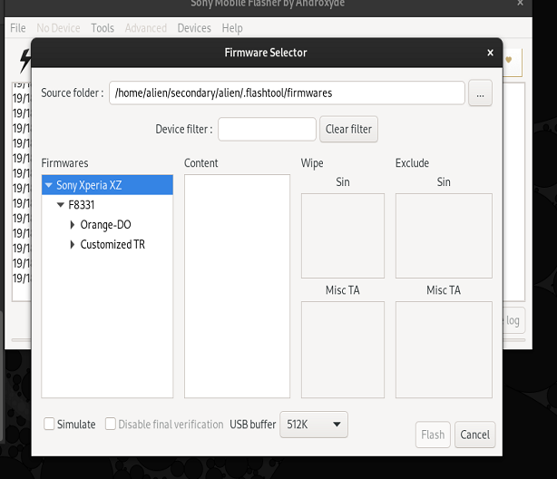

# sony-xperia-xz-F8331-root
Tutorial for rooting the sony xperia xz

# Introduction

Here is a small tutorial for rooting the sony xperia xz F8331. I am making this tutorial because I found it hard to do it and although I could manage to do it, it wasn't something really intuitive. 

We are going to be rooting by flashing a custom kernel "boot.img" and installing the zip file there.

> [!info]
> All the data of your device is going to be deleted so make sure you don't have any personal information stored

# Requisites

- sony xperia xz F8331 with the latest android 8.0 oreo
- window/linux machine (I will use ubuntu)
- small knowledge of adb commands
- adb and fastboot installed (on ubuntu sudo apt install adb fastboot -y)
- flashtool (https://www.flashtool.net/download.html I downloaded the Linux version)

# Step 1: Unlocking the OEM

We need to unlock the OEM in order to load our custo .img recovery. So we will go to settings -> system -> about phone -> click 5 times on "build number".
Then go to settings -> system -> "developer tools" and enable "OEM unlocking" and "USB debugging".
After that go and follow the steps (https://developer.sony.com/open-source/aosp-on-xperia-open-devices/get-started/unlock-bootloader) to unlock bootloader. 

Connect the device to your pc. You will need to input the IMEI and you will get in return a code that we will input to unlock the booloader.
`adb reboot bootloader` to enter in bootloader mode
`fastboot oem unlock 0xkey_you_got`.

`adb reboot system` 
This will unlock the bootloader and erase all your data. After that go to settings -> system -> developer tools and enable other time "usb debugging".

# Step 2: Flash the firmware (in case you have other build version)
In case you don't have the same firmware vesion you need to flash this one. Settings -> system -> about phone -> build compilation
to check the compilation number. We will use the 41.3.A.2.192 and make sure you have that one


click on "Flashmode"


select the downloaded firmware, we select "Customized TR"


click on flash and follow the instructions. It will basically ask us to unplug the phone, power off the phone, and connect to usb while pressing volume down.
It will flash the firmware.

After that you can execute `adb reboot system`

# Step 3: boot into TWRP and install magisk

Once you make sure you have the same build compilation, you do `adb reboot bootloader` or you can enter in bootloader mode also by pressing the volume up button while you are are connecting to the pc. The phone is poweroff and you plug in to the pc.

In the repository I have uploaded a few twrp versions, but we are going to be using the twrp-3.2.1. 

> [!info]
> At the time of writing this we the latest version of twrp is the 3.7; but those version weren't working for me because they were asking mre for password for FDE. This apply for high order android devices
> The same happens for Magisk, we are going to use v17 although they are higher versions that apply for android that has higher version.

We transfer the necessary files for the installation


```bash
git clone https://github.com/cabiamdos/sony-xperia-xz-F8331-root
fastboot boot twrp-3.2.1-20171219-boot-kagura.img
cd files
adb push ./DRM-Fix_System_mode.zip /tmp
adb push ./Magisk-v17.1.zip /sdcard/Download
adb push ./MatiskManager-v6.0.1.apk /sdcard/Download
adb push ./root-checker-6-5-3.apk /sdcard/Download
adb push ./TWRP-Recovery/twrp-3.2.1-20171219-fota-kagura.zip /tmp
adb push ./kernel_F8331_41.3.A.2.192/boot.img /tmp
```
we enter in fastboot mode, swipe.
click on mount -> /system


Then we go back and we click on install -> zip file and we install "twrp-3.2.1-20171219-fota-kagura.zip"
Then go back, click on install -> flash image (or something similar) and we select the "boot.img"
Then go back, click on install -> zip file and we select "DRM-Fix_System_mode.zip"
Then go back, click on install -> zip file and we select "Magisk-v17.1.zip" 


(image is from the internet for illustrative purposes)


Now we can reboot

# Step 4: installing magisk apk

We can install magisk apk from the file archive in the download folder we have previously transferred, or we can do:
`adb install MagiskManager-v6.0.1.apk` 
`adb install root-checker-6-5-3.apk`

We should be verifying that everything is working by entering in magisk manager and checking with root-checker app that the device has been successfully rooted


# Acknowledges & Resources

Here I am going to point to resources where I have extract my ideas. There is also another "readme_irrelevant.md" with the "irrelevant_files" in which I will talk about the ideas that I have read but never end up working. Most of the sources I point out they don't have the kernel image that's why I re-uploaded with the right kernel image.
- https://xdaforums.com/t/guide-how-to-extracting-a-boot-img-from-an-ftf.2699858/
- https://github.com/AndroPlus-org/android_kernel_sony_msm8996
- https://github.com/AndroPlus-org/build_tools_xperia
- https://www.htcmania.com/archive/index.php/t-1254395.html
- https://xdaforums.com/t/magisk-the-magic-mask-for-android.3473445/
- https://xdaforums.com/t/guide-oreo-8-0-root-twrp-drm-fix-docomo-s0-01j-41-3-b-2-2.3892124/
- https://xdaforums.com/t/kernel-mod-sony-stock-patcher-for-xperia-xz.3576493/
- https://github.com/AdrianDC/kernel-sony-copyleft
- https://mega.nz/folder/K8kUDSaD#LNVmLKHANgwYPuc-aFO-Mg
- https://xdaforums.com/t/root-kernel-twrp-repack-of-the-stock-kernel-with-dm-verity-and-sony-ric-off.3301605/page-140#post-74724162
- https://xdaforums.com/t/sony-xperia-xz-unlock-bootloader-twrp-and-root.3640302/
- https://xdaforums.com/t/eol-eas-hmp-unofficial-lineage-os-15-1-for-xperia-xz.4418023/
- https://xdaforums.com/t/twrp-root-oreo-8-0-f833x-guide-to-root-stock-oreo-xz.3911375/  (this source is where most hings worked for me and maybe the main link still works https://mega.nz/folder/XS4ywSqK#XJ16539eAB-lnCupP7R-Zw)
- https://github.com/kdrag0n/safetynet-fix (I never installed this)
- https://xdaforums.com/t/kernel-mod-sony-stock-patcher-for-xperia-xz.3576493/ (don't know much about this)
